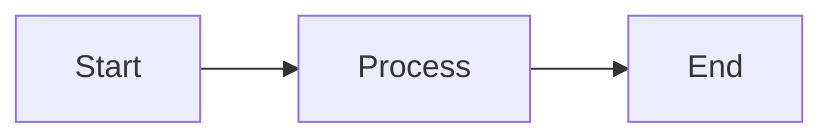
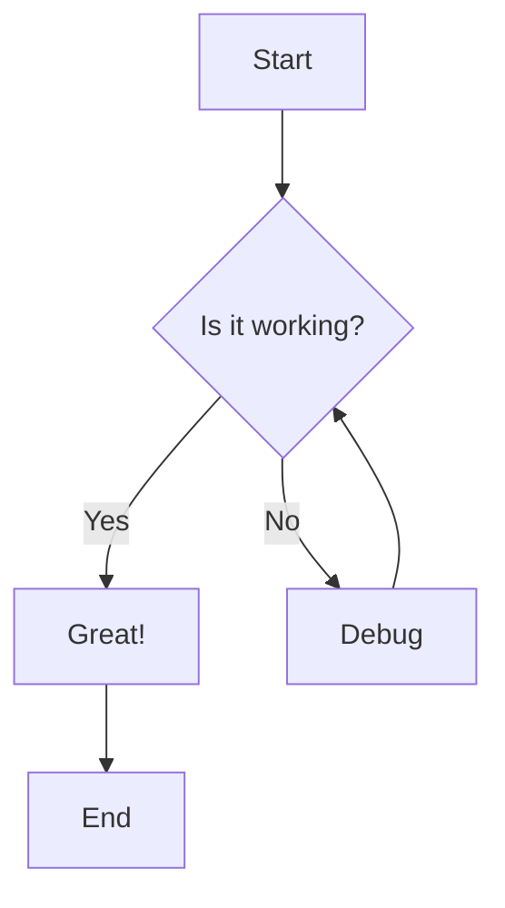
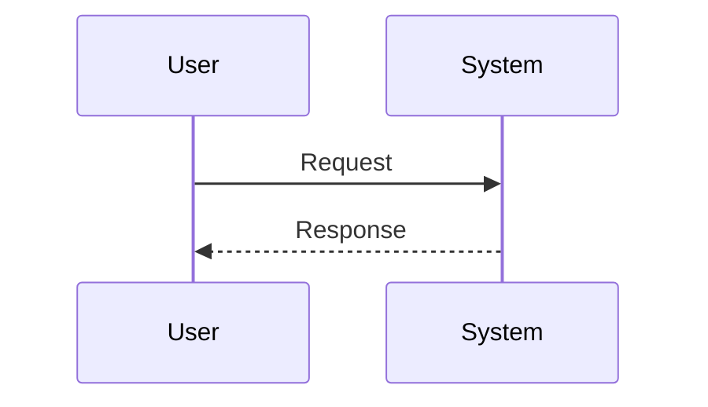
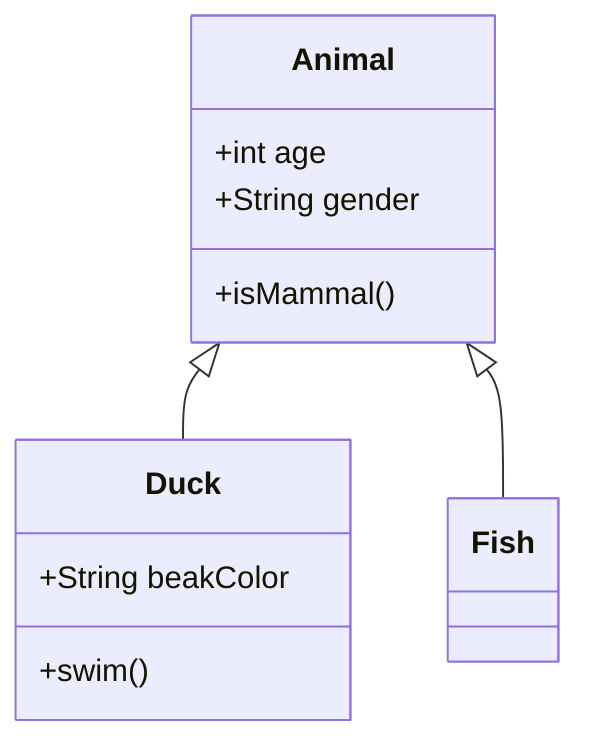
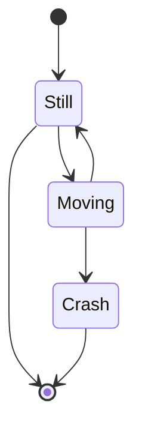
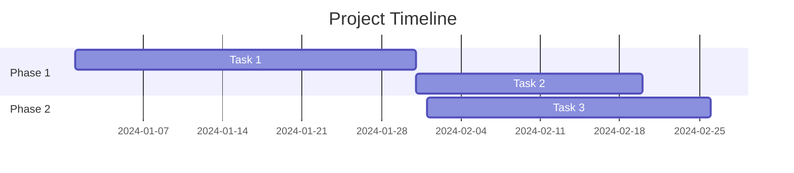

# Mermaid Support Testing Guide

## Overview

This guide provides step-by-step instructions to build and test the new Mermaid diagram support that was recently merged.

## Prerequisites

- Docker installed and running
- At least 5GB of free disk space
- Stable internet connection (Node.js installation downloads ~45MB of packages)

## Build Process

### Option 1: Full Build (Recommended)

```bash
cd /Users/stefan.oehrli/Development/github/oehrlis/docker-pandoc

# Build image locally (single platform for testing)
make build

# This will:
# - Build for your current architecture (arm64 or amd64)
# - Install Node.js 18.x
# - Install ~387 Node.js dependencies
# - Install mermaid-cli via npm
# - Tag as oehrlis/pandoc:4.0.0 and oehrlis/pandoc:latest
```

**Build time estimate**: 10-15 minutes (depending on network speed)

### Option 2: Direct Docker Build

```bash
cd /Users/stefan.oehrli/Development/github/oehrlis/docker-pandoc

# Build without make
docker build -t oehrlis/pandoc:test .

# Or with no cache to ensure fresh build
docker build --no-cache -t oehrlis/pandoc:test .
```

### Option 3: Build with Specific Platform

```bash
# For ARM64 (Apple Silicon)
docker build --platform linux/arm64 -t oehrlis/pandoc:test .

# For AMD64 (Intel/AMD)
docker build --platform linux/amd64 -t oehrlis/pandoc:test .
```

## Verify Installation

### Step 1: Check Pandoc Version

```bash
docker run --rm oehrlis/pandoc:test --version
```

**Expected output:**

```
pandoc 3.8.3
Features: +server +lua
...
```

### Step 2: Check Mermaid CLI Installation

```bash
docker run --rm --entrypoint sh oehrlis/pandoc:test -c "command -v mmdc && mmdc --version"
```

**Expected output:**

```
/usr/local/bin/mmdc
11.4.0
```

**If this fails:**

- The build didn't complete successfully
- Node.js or mermaid-cli wasn't installed
- Check build logs for errors in the `install_mermaid.sh` step

### Step 3: Check Lua Filter

```bash
docker run --rm --entrypoint sh oehrlis/pandoc:test -c "ls -la /workdir/mermaid.lua"
```

**Expected output:**

```
-rw-r--r--    1 root     root          XXXX Jan 21 XX:XX /workdir/mermaid.lua
```

## Test Mermaid Rendering

### Test 1: Simple Mermaid Diagram

```bash
cd /Users/stefan.oehrli/Development/github/oehrlis/docker-pandoc/examples

# Generate PDF with Mermaid diagrams
docker run --rm -v $PWD:/workdir:z oehrlis/pandoc:test \
  test-mermaid.md -o test-mermaid.pdf \
  --lua-filter /workdir/../mermaid.lua

# Check if PDF was created
ls -lh test-mermaid.pdf
```

**Expected result:**

- `test-mermaid.pdf` file created (size should be >50KB)
- PDF should contain rendered diagrams (flowchart and sequence diagram)

**If this fails:**

- Error message will indicate the problem
- Common issues:
  - "mmdc: command not found" → mermaid-cli not installed
  - "cannot open display" → Puppeteer/Chromium configuration issue
  - "Permission denied" → Volume mount or user permissions

### Test 2: Check Generated Images

Mermaid diagrams are converted to images first. Check if they're generated:

```bash
# Run with verbose output to see intermediate files
docker run --rm -v $PWD:/workdir:z oehrlis/pandoc:test \
  --lua-filter /workdir/../mermaid.lua \
  test-mermaid.md -o test-mermaid-verbose.pdf --verbose

# Look for generated PNG/SVG files
ls -la *.png *.svg 2>/dev/null
```

### Test 3: Test with Custom Document

Create a simple test document:

```bash
cd /Users/stefan.oehrli/Development/github/oehrlis/docker-pandoc

cat > mermaid-test-simple.md <<'EOF'
# Simple Mermaid Test

## Flowchart



## Done

EOF

# Generate PDF

docker run --rm -v $PWD:/workdir:z oehrlis/pandoc:test \
  mermaid-test-simple.md -o mermaid-test-simple.pdf \
  --lua-filter /workdir/mermaid.lua

# Open the PDF

open mermaid-test-simple.pdf  # macOS

# or

xdg-open mermaid-test-simple.pdf  # Linux

```

## Troubleshooting

### Issue: Build Hangs or Times Out
**Symptoms**: Build stops at Node.js installation step

**Solution**:
1. Check internet connection
2. Try building during off-peak hours
3. Increase Docker resource limits (memory/CPU)
4. Use `--no-cache` to avoid stale cache issues

### Issue: "mmdc not found" Error
**Symptoms**: Lua filter fails with command not found

**Diagnosis**:
```bash
# Check if Node.js is installed
docker run --rm --entrypoint sh oehrlis/pandoc:test -c "node --version"

# Check if npm is installed
docker run --rm --entrypoint sh oehrlis/pandoc:test -c "npm --version"

# Check installed npm packages
docker run --rm --entrypoint sh oehrlis/pandoc:test -c "npm list -g --depth=0"
```

**Solution**: Rebuild image ensuring `scripts/install_mermaid.sh` executes successfully

### Issue: Chromium/Puppeteer Errors

**Symptoms**: Errors about display, sandbox, or browser

**Possible errors**:

```
Error: Failed to launch the browser process!
No usable sandbox! Update your kernel
```

**Check Puppeteer configuration**:

```bash
docker run --rm --entrypoint sh oehrlis/pandoc:test -c "cat /workdir/.config/puppeteer/config.json"
```

**Expected content**:

```json
{
  "args": ["--no-sandbox", "--disable-setuid-sandbox"]
}
```

**Solution**: This should be handled automatically by `install_mermaid.sh`. If not, rebuild with `--no-cache`.

### Issue: Permission Errors

**Symptoms**: Cannot write output file

**Solution**:

```bash
# Ensure output directory is writable
chmod 755 $PWD

# Or run with user mapping (if needed)
docker run --rm --user $(id -u):$(id -g) \
  -v $PWD:/workdir:z oehrlis/pandoc:test \
  test-mermaid.md -o test-mermaid.pdf \
  --lua-filter /workdir/../mermaid.lua
```

### Issue: Build Interrupted

**Symptoms**: Build was cancelled/interrupted mid-way

**Solution**:

```bash
# Clean up partial images
docker image prune -f

# Remove failed build
docker rmi oehrlis/pandoc:test 2>/dev/null || true

# Rebuild from scratch
docker build --no-cache -t oehrlis/pandoc:test .
```

## Verify Build Components

Run these checks to ensure all components are installed correctly:

```bash
# All-in-one verification script
docker run --rm --entrypoint sh oehrlis/pandoc:test -c "
  echo '=== System Info ==='
  cat /etc/os-release | grep PRETTY_NAME
  echo ''
  echo '=== Pandoc ==='
  pandoc --version | head -3
  echo ''
  echo '=== Node.js ==='
  node --version
  echo ''
  echo '=== npm ==='
  npm --version
  echo ''
  echo '=== Mermaid CLI ==='
  mmdc --version
  echo ''
  echo '=== Lua Filter ==='
  ls -la /workdir/mermaid.lua
  echo ''
  echo '=== Puppeteer Config ==='
  cat /workdir/.config/puppeteer/config.json 2>/dev/null || echo 'Not found'
"
```

**Expected output** (all checks should pass):

```
=== System Info ===
PRETTY_NAME="Debian GNU/Linux 12 (bookworm)"

=== Pandoc ===
pandoc 3.8.3
Features: +server +lua
Scripting engine: Lua 5.4

=== Node.js ===
v18.20.4

=== npm ===
10.7.0

=== Mermaid CLI ===
11.4.0

=== Lua Filter ===
-rw-r--r--    1 root     root          XXXX /workdir/mermaid.lua

=== Puppeteer Config ===
{
  "args": ["--no-sandbox", "--disable-setuid-sandbox"]
}
```

## Advanced Testing

### Test Different Diagram Types

Create a comprehensive test file:

```bash
cat > examples/comprehensive-mermaid-test.md <<'EOF'
---
title: "Comprehensive Mermaid Test"
---

# Mermaid Diagram Test Suite

## 1. Flowchart


## 2. Sequence Diagram



## 3. Class Diagram



## 4. State Diagram



## 5. Gantt Chart



EOF

# Generate PDF

docker run --rm -v $PWD/examples:/workdir:z oehrlis/pandoc:test \
  comprehensive-mermaid-test.md -o comprehensive-mermaid-test.pdf \
  --lua-filter /workdir/../mermaid.lua \
  --toc -N

# Check result

ls -lh examples/comprehensive-mermaid-test.pdf

```

### Performance Testing

```bash
# Time the build
time docker run --rm -v $PWD/examples:/workdir:z oehrlis/pandoc:test \
  test-mermaid.md -o test-mermaid-perf.pdf \
  --lua-filter /workdir/../mermaid.lua
```

## CI/CD Integration

Once manual testing passes, the image can be pushed to Docker Hub:

```bash
# Tag for Docker Hub
docker tag oehrlis/pandoc:test oehrlis/pandoc:4.0.0-mermaid

# Push (requires authentication)
docker push oehrlis/pandoc:4.0.0-mermaid
```

## Summary Checklist

- [ ] Build completes without errors
- [ ] `pandoc --version` shows version 3.8.3
- [ ] `mmdc --version` shows mermaid-cli version
- [ ] `mermaid.lua` filter exists
- [ ] Simple test generates PDF successfully
- [ ] PDF contains rendered diagrams (not code blocks)
- [ ] No Chromium/sandbox errors
- [ ] Comprehensive test with all diagram types works

## Next Steps

If all tests pass:

1. Update CHANGELOG.md with Mermaid support
2. Update README.md with Mermaid usage examples
3. Create release notes
4. Tag and push to Docker Hub
5. Update GitHub release

## Support

If you encounter issues not covered here:

1. Check build logs: `docker build . 2>&1 | tee build-debug.log`
2. Search for similar issues in the repository
3. Create a GitHub issue with:
   - Build log
   - Error messages
   - System information (OS, Docker version)
   - Steps to reproduce
