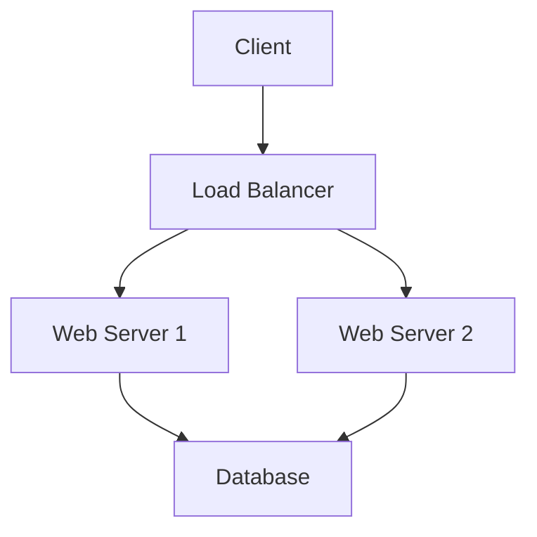

# Pandoc Docker Images

[](https://github.com/oehrlis/docker-pandoc/actions/workflows/ci.yml)
[](https://github.com/oehrlis/docker-pandoc/actions/workflows/release.yml)
[](https://hub.docker.com/r/oehrlis/pandoc)
[](https://hub.docker.com/r/oehrlis/pandoc)
[](LICENSE)

<!-- markdownlint-disable MD013 -->
Docker image for the universal document converter [pandoc](https://pandoc.org) with full PDF conversion support and custom LaTeX templates. Includes a minimal [TexLive](https://www.tug.org/texlive/) installation optimized for document conversion. Source available at [oehrlis/docker-pandoc](https://github.com/oehrlis/docker-pandoc).
<!-- markdownlint-enable MD013 -->

## Features

- **Pandoc** - Latest version from GitHub releases
- **LaTeX** - Minimal TexLive installation with essential packages
- **Templates** - Custom templates (OraDBA, TechDoc, Trivadis) for professional documents
- **Fonts** - MS Core Fonts, Open Sans, Montserrat
- **Multi-arch** - Supports both linux/amd64 and linux/arm64 platforms

<!-- markdownlint-enable MD013 -->

## Run

<!-- markdownlint-disable MD013 -->
The pre build image is available via [Dockerhub](https://hub.docker.com/r/oehrlis/pandoc/). The installation and use is straightforward. Install [Docker](https://www.docker.com/get-started) and pull the image.
<!-- markdownlint-enable MD013 -->

<!-- markdownlint-enable MD013 -->

```bash
docker pull oehrlis/pandoc
```

<!-- markdownlint-disable MD013 -->
Either you copy the files into the container, which is obviously not really handy, or you mount your local document folder as volume and run it.
<!-- markdownlint-enable MD013 -->

<!-- markdownlint-enable MD013 -->

```bash
docker run --rm -v $PWD:/workdir:z oehrlis/pandoc <OPTIONS>
```

Conversion of the sample Markdown file into a PDF using the default LaTeX template.

```bash
cd sample
docker run --rm -v $PWD:/workdir:z oehrlis/pandoc sample.md \
    -o sample.pdf --toc -N --listings
```

Conversion of the sample Markdown file into a PDF using the OraDBA LaTeX template and XeLaTeX for include custom TTF fonts.

```bash
cd sample
docker run --rm -v $PWD:/workdir:z oehrlis/pandoc --pdf-engine=xelatex sample.md \
    -o sample_oradba.pdf --template oradba --toc -N --listings
```

```bash
cd sample
docker run --rm -v $PWD:/workdir:z oehrlis/pandoc sample.md \
    -o sample_oradba.pdf --template oradba --toc -N --listings
```

Alternatively you can open a shell in the container and use the miscellanies pandoc and tex tools interactively.

```bash
docker run -it --rm -v $PWD:/workdir:z --entrypoint sh oehrlis/pandoc
```

## Included Templates

This repository includes custom Pandoc templates for professional document generation:

- **oradba** - OraDBA corporate template with branding
- **techdoc** - Technical documentation template
- **trivadis** - Trivadis corporate template
- **GitHub** - GitHub-style HTML output

Templates are located in the [`templates/`](templates/) directory.

### Using Custom Templates

```bash
# Use OraDBA template with PDF output
docker run --rm -v $PWD:/workdir:z oehrlis/pandoc \
    document.md -o output.pdf --template oradba --pdf-engine=xelatex

# Use TechDoc template
docker run --rm -v $PWD:/workdir:z oehrlis/pandoc \
    document.md -o output.pdf --template techdoc --pdf-engine=xelatex

# Advanced: Custom title page, headers, filters
docker run --rm -v $PWD:/workdir:z oehrlis/pandoc \
    --metadata-file=metadata.yml \
    --template oradba \
    --pdf-engine=xelatex \
    --filter pandoc-latex-environment \
    --resource-path=images \
    -o output.pdf \
    doc/?x??-*.md
```

### Advanced Template Features

The templates support extensive customization including:

- Custom title pages with logos and colors
- Configurable headers and footers
- Table of contents and lists of figures/tables
- Colored boxes for notes, tips, warnings (via filters)
- Book mode with chapter organization
- Custom fonts and typography
- Multiple output formats (PDF, DOCX, PPTX, HTML, EPUB)

**For comprehensive documentation**, see:

- **[AUTHOR_GUIDE.md](AUTHOR_GUIDE.md)** - Complete authoring guide with
  advanced template options, metadata configuration, formatting examples, and
  troubleshooting
- **[Sample metadata.yml](sample/metadata.yml)** - Example configuration file

## Diagram Support

This image includes built-in support for **Mermaid diagrams**, which are automatically rendered during PDF generation.

### Mermaid Diagrams

Mermaid diagrams in Markdown code blocks are automatically detected and rendered to PNG images during Pandoc execution. No manual pre-rendering required.

**Usage Example:**

```markdown
# My Document

## System Architecture


```

**Generate PDF with Mermaid:**

```bash
docker run --rm -v $PWD:/workdir:z oehrlis/pandoc \
  document.md -o output.pdf \
  --lua-filter /usr/local/share/pandoc/filters/mermaid.lua \
  --pdf-engine=xelatex
```

**Features:**
- Automatic rendering to PNG images
- Transparent backgrounds for clean integration
- Hash-based caching (diagrams only re-rendered if changed)
- Support for all Mermaid diagram types (flowcharts, sequence diagrams, class diagrams, etc.)
- Output directory: `build/mermaid/` (created automatically)

**Supported Diagram Types:**
- Flowcharts
- Sequence diagrams  
- Class diagrams
- State diagrams
- Entity relationship diagrams
- Gantt charts
- Pie charts
- Git graphs
- And more - see [Mermaid documentation](https://mermaid.js.org/)

### Alternative Diagram Tools

For diagram rendering in PDF documents, consider these alternatives that work well in containerized environments:

**PlantUML** - Comprehensive UML and architecture diagrams

```bash
# Java-based, works in containers
docker run --rm -v $PWD:/workdir oehrlis/pandoc \
  input.md -o output.pdf --filter pandoc-plantuml
```

**Graphviz** - Graph visualizations and flowcharts

```bash
# C-based, lightweight, container-friendly
dot -Tpng diagram.dot -o diagram.png
```

**TikZ** - LaTeX-native diagrams (built into TeX Live)

```latex
\begin{tikzpicture}
  \node (A) at (0,0) {Start};
  \node (B) at (2,0) {End};
  \draw[->] (A) -- (B);
\end{tikzpicture}
```

## Build and add new packages

<!-- markdownlint-disable MD013 -->
If you plan to alter or extend this Docker image you could get the corresponding files from [GitHub](https://github.com/oehrlis/docker-pandoc) and build the image manually.
<!-- markdownlint-enable MD013 -->

<!-- markdownlint-enable MD013 -->

```bash
git clone git@github.com:oehrlis/docker-pandoc.git
$ cd docker-pandoc
$ docker build -t oehrlis/pandoc .
```

Optionally you can add additional texlive package to the `tlmgr` command in the Dockerfile.

Alternatively you can use the `build.sh` script.

```bash
git clone git@github.com:oehrlis/docker-pandoc.git
$ cd docker-pandoc
$ build.sh
```

## Development

This project uses automated CI/CD pipelines for building, testing, and releasing Docker images.

### Using Makefile

The project includes a comprehensive Makefile for common development tasks:

```bash
# Display all available targets
make help

# Build the Docker image locally
make build

# Build multi-platform image
make build-multi

# Run all linting checks
make lint

# Build sample documents to test
make test-samples

# Open an interactive shell in the container
make shell

# Clean up build artifacts
make clean
```

### Linting Locally

Run linters before submitting pull requests:

```bash
# Run all linters
make lint

# Run individual linters
make lint-shell          # shellcheck
make lint-shell-format   # shfmt
make lint-markdown       # markdownlint
make lint-docker         # hadolint
```

**Installing linting tools**:

```bash
# Shellcheck
apt-get install shellcheck  # Ubuntu/Debian
brew install shellcheck     # macOS

# shfmt
curl -L "https://github.com/mvdan/sh/releases/download/v3.8.0/shfmt_v3.8.0_linux_amd64" -o shfmt
chmod +x shfmt && sudo mv shfmt /usr/local/bin/

# markdownlint-cli
npm install -g markdownlint-cli

# hadolint
wget https://github.com/hadolint/hadolint/releases/download/v2.12.0/hadolint-Linux-x86_64
chmod +x hadolint-Linux-x86_64 && sudo mv hadolint-Linux-x86_64 /usr/local/bin/hadolint
```

### Creating a New Release

To create a new release:

```bash
# Interactive release process
make release
```

This will:

1. Prompt for a new version number
2. Update the VERSION file
3. Create a git commit and tag
4. Optionally push the tag to trigger the automated release workflow

The release workflow will:

- Build multi-platform Docker images (linux/amd64, linux/arm64)
- Push images to Docker Hub with version and `latest` tags
- Build sample documents to verify functionality
- Create a GitHub release with auto-generated notes

### Setting Up Docker Hub Credentials for GitHub Actions

Repository maintainers need to configure Docker Hub credentials in GitHub secrets:

1. Go to repository **Settings** → **Secrets and variables** → **Actions**
2. Add the following secrets:
   - `DOCKERHUB_USERNAME`: Your Docker Hub username
   - `DOCKERHUB_TOKEN`: Docker Hub access token (create at hub.docker.com/settings/security)

See [`.github/SETUP.md`](.github/SETUP.md) for detailed setup instructions.

### Contributing

Contributions are welcome! Please read [CONTRIBUTING.md](CONTRIBUTING.md) for details on:

- Development setup
- CI/CD pipeline
- Release process
- Linting requirements
- Pull request process

## Issues

Please file your bug reports, enhancement requests, questions and other support requests within [Github's issue tracker](https://help.github.com/articles/about-issues/):

- [Existing issues](https://github.com/oehrlis/docker-pandoc/issues)
- [submit new issue](https://github.com/oehrlis/docker-pandoc/issues/new)

## Documentation

This project maintains comprehensive documentation for different audiences:

### For Users

- **[README.md](README.md)** (this file) - Quick start and basic usage
- **[AUTHOR_GUIDE.md](AUTHOR_GUIDE.md)** - Complete authoring guide with
  advanced template options, metadata configuration, formatting examples, and
  troubleshooting
- **[examples/](examples/)** - Sample documents and configurations
  - [formatting-examples.md](examples/formatting-examples.md) - Comprehensive
    formatting reference
  - [metadata-advanced.yml](examples/metadata-advanced.yml) - Complete metadata
    configuration example

### For Contributors and Developers

- **[CONTRIBUTING.md](CONTRIBUTING.md)** - How to contribute to the project
- **[DEVELOPMENT.md](DEVELOPMENT.md)** - Development workflow, build system,
  testing, and release process
- **[.github/SETUP.md](.github/SETUP.md)** - GitHub Actions and CI/CD setup
  (for maintainers)

### Additional Resources

- **[CHANGELOG.md](CHANGELOG.md)** - Version history and changes
- **[LICENSE](LICENSE)** - Apache License 2.0

## References

- GitHub Project [oehrlis/docker-pandoc]
  (<https://github.com/oehrlis/docker-pandoc>) - This repository
- GitHub Project [oehrlis/pandoc_template]
  (<https://github.com/oehrlis/pandoc_template>) - Original template repository
  with extensive examples
- [pandoc](https://pandoc.org) - Universal document converter
- [Pandoc User's Guide](https://pandoc.org/MANUAL.html) - Complete Pandoc
  documentation
- [TexLive](https://www.tug.org/texlive/) - TeX document production system
- GitHub [google/fonts](https://github.com/google/fonts) - Open source fonts
- GitHub [danstoner/pandoc_samples](https://github.com/danstoner/pandoc_samples)
  - Pandoc examples
- GitHub [Wandmalfarbe/pandoc-latex-template]
  (<https://github.com/Wandmalfarbe/pandoc-latex-template>) - Eisvogel template
  (inspiration)
- [Google Fonts](https://fonts.google.com/) - Montserrat and Open Sans
- [MS Core Fonts](http://mscorefonts2.sourceforge.net/) - Microsoft Core and
  ClearType fonts
- [Mermaid CLI Documentation](https://github.com/mermaid-js/mermaid-cli) - Diagram rendering
- [Pandoc Filters Documentation](https://pandoc.org/filters.html) - Filter system documentation
- [Awesomebox Package](https://ctan.org/pkg/awesomebox) - Colored boxes for LaTeX
