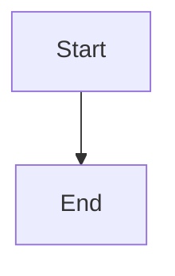

# Pandoc Docker Images

Docker scripts to build an image to run the universal document converter [pandoc](https://pandoc.org) including support to convert PDF files. The image includes a reduced [TexLive 2022](https://www.tug.org/texlive/) installation to support simple PDF transformations and Mermaid diagram rendering support for generating diagrams in PDFs. Additional TexLive packages have to be installed by extending this images. Source can be found in GitHub [oehrlis/docker-pandoc](https://github.com/oehrlis/docker-pandoc).

## Run

The pre build image is available via [Dockerhub](https://hub.docker.com/r/oehrlis/pandoc/). The installation and use is straightforward. Install [Docker](https://www.docker.com/get-started) and pull the image.

```bash
docker pull oehrlis/pandoc
```

Either you copy the files into the container, which is obviously not really handy, or you mount your local document folder as volume and run it.

```bash
docker run --rm -v $PWD:/workdir:z oehrlis/pandoc <OPTIONS>
```

Conversion of the sample Markdown file into a PDF using the default LaTeX template.

```bash
cd sample
docker run --rm -v $PWD:/workdir:z oehrlis/pandoc sample.md \
    -o sample.pdf --toc -N --listings
```

Conversion of the sample Markdown file into a PDF using the OraDBA LaTeX template and XeLaTeX for include custom TTF fonts.

```bash
cd sample
docker run --rm -v $PWD:/workdir:z oehrlis/pandoc --pdf-engine=xelatex sample.md \
    -o sample_oradba.pdf --template oradba --toc -N --listings
```

```bash
cd sample
docker run --rm -v $PWD:/workdir:z oehrlis/pandoc sample.md \
    -o sample_oradba.pdf --template oradba --toc -N --listings
```

Alternatively you can open a shell in the container and use the miscellanies pandoc and tex tools interactively.

```bash
docker run -it --rm -v $PWD:/workdir:z --entrypoint sh oehrlis/pandoc
```

## Mermaid Diagram Support

This image includes support for rendering Mermaid diagrams in PDF output.

### Usage with Mermaid

To convert Markdown files containing Mermaid diagrams to PDF:

```bash
docker run --rm \
    -v $(pwd):/workdir \
    oehrlis/pandoc:latest \
    input.md \
    -o output.pdf \
    --filter mermaid-filter \
    --pdf-engine=xelatex
```

### Mermaid Example

Include Mermaid diagrams in your Markdown using code blocks:



The diagrams will be automatically rendered as images in the PDF output.

### Installed Components

- **mermaid-cli**: Latest version from npm
- **mermaid-filter**: Latest version from npm
- **Chromium**: System chromium browser for rendering

## Build and add new packages

If you plan to alter or extend this Docker image you could get the corresponding files from [GitHub](https://github.com/oehrlis/docker-pandoc) and build the image manually.

```bash
git clone git@github.com:oehrlis/docker-pandoc.git
$ cd docker-pandoc
$ docker build -t oehrlis/pandoc .
```

Optionally you can add additional texlive package to the `tlmgr` command in the Dockerfile.

Alternatively you can use the `build.sh` script.

```bash
git clone git@github.com:oehrlis/docker-pandoc.git
$ cd docker-pandoc
$ build.sh
```

## Issues

Please file your bug reports, enhancement requests, questions and other support requests within [Github's issue tracker](https://help.github.com/articles/about-issues/):

- [Existing issues](https://github.com/oehrlis/docker-pandoc/issues)
- [submit new issue](https://github.com/oehrlis/docker-pandoc/issues/new)

## References

- GitHub Project [oehrlis/docker-pandoc](https://github.com/oehrlis/docker-pandoc) related to this container.
- [pandoc](https://pandoc.org)
- [TexLive 2022](https://www.tug.org/texlive/)
- GitHub [google/fonts](https://github.com/google/fonts)
- GitHub [danstoner/pandoc_samples](https://github.com/danstoner/pandoc_samples)
- GitHub [Wandmalfarbe/pandoc-latex-template](https://github.com/Wandmalfarbe/pandoc-latex-template)
- [Google Fonts](https://fonts.google.com/) Montserrat and Open Sans Light
- Get Microsoft's Core Fonts for the Web and ClearType Fonts (<http://mscorefonts2.sourceforge.net/>)
- [Mermaid CLI Documentation](https://github.com/mermaid-js/mermaid-cli)
- [Pandoc Filters Documentation](https://pandoc.org/filters.html)
- [mermaid-filter npm package](https://www.npmjs.com/package/mermaid-filter)
