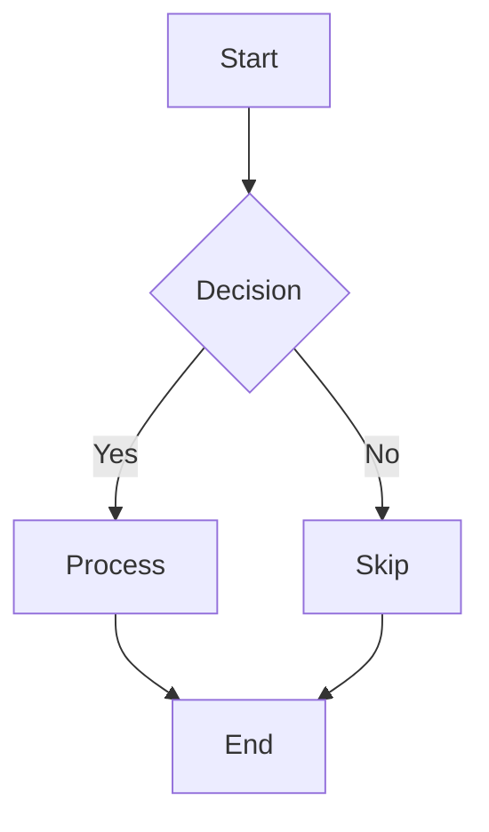
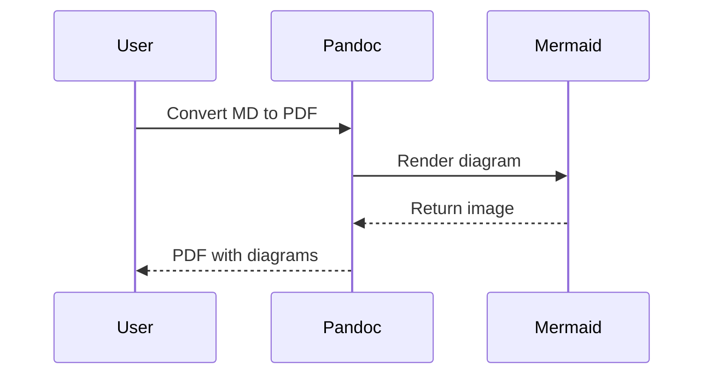

# Mermaid Test

## Flowchart Example

```mermaid
flowchart TD
    A[Start] --> B{Decision}
    B -->|Yes| C[Process]
    B -->|No| D[Skip]
    C --> E[End]
    D --> E
```

## Sequence Diagram Example

```mermaid
sequenceDiagram
    participant User
    participant Pandoc
    participant Mermaid
    User->>Pandoc: Convert MD to PDF
    Pandoc->>Mermaid: Render diagram
    Mermaid-->>Pandoc: Return image
    Pandoc-->>User: PDF with diagrams
```
